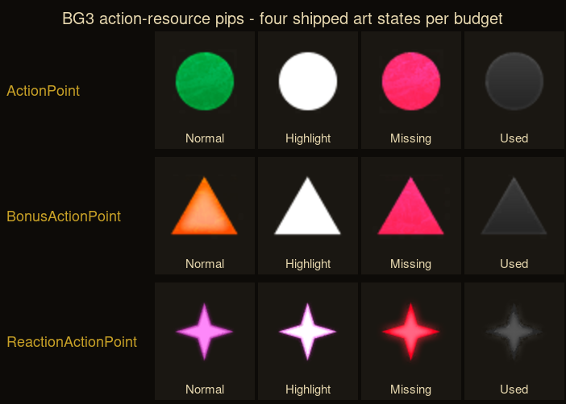
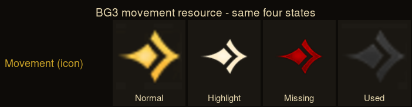

# STUDY 20 — BG3's combat presentation, from the UI layer

**⚠ TWO OF THE THREE QUESTIONS ARE ANSWERED. ONE IS NOT, AND IT IS THE ONE THAT
GENUINELY IS NOT IN A FILE.**

---

## ⚠ The brief's premise was too strong, and so was my first answer

The brief said: *"none of it is in a .pak, and files cannot answer it… PLAY IT
AND WATCH."* **I accepted that, failed to launch the game, and wrote a stop
report.** The owner asked *"why can't we just look at the game files?"* and that
was correct.

**BG3's UI is Noesis GUI. Every screen ships as a `.xaml` layout file inside
`Game.pak` — 310 of them — and the art ships as `.DDS` beside them.** A screen's
widget tree, its states, its animation timings and its data bindings are all
readable. **That is presentation as data.**

**⚠ This is the project's own recurring failure, committed by me:** `STUDY 19`
searched `Stats/Generated/Data` and `inputconfig.json` and concluded presentation
was unreachable. **It was a rigorous check aimed at the wrong directory.** The
GUI tree was never looked at.

**What files still cannot answer** is named in `§4`, and it is one thing, not
three.

---

## 1 · THE ROLL — `PT-1326`, `PT-1429`

### ⚠⚠ BG3 ships TWO roll presentations, and the split is the design

| | `PassiveRoll.xaml` (6.5 KB) | `ActiveRoll.xaml` (160 KB) |
|---|---|---|
| when | the game rolled **for** you | **you** chose to roll |
| form | a toast, bottom-right | a **modal**, centre screen |
| lifetime | **5 s visible, 1 s fade, removed at 6 s** | until you dismiss it |
| interaction | **none** | add modifiers, reroll, continue |
| size ratio | **1** | **24×** |

**⚠ The ceremony is proportional to the agency.** A roll the player did not
choose gets a five-second toast and gets out of the way. A roll they chose
becomes the only thing on screen.

### The passive toast, read verbatim from the file

Its whole text is:

```
{SkillOrAbility}  <translated word>  [d20 icon]  <Success|Failure>, {RollResult} ({SkillOrAbility})
```

**⚠ It states the NUMBER.** `<Run Text="{Binding RollResult}"/>`. Success and
failure are two `DataTrigger` branches on `{Binding Success}` over one
`TextBlock`.

**⚠ And it moves out of the way of the combat log.** Its margin is bound to
`CurrentPlayer.UIData.CombatLogSize` — `0,0,20,440` normally, `690` when the log
is `Expanded`, `1050` when `SuperExpanded`. **A transient message knows about the
persistent panel beside it and yields to it.**

### The active roll, from its named parts and bindings

`RollState` is bound **30 times** — the screen is a state machine over the roll,
not a result display. What it carries:

* **`modlist`, `boostmodlist`, `selectedboostmodlist`, `BonusModifiers`,
  `BonussesTitle`** — every modifier is **itemised**, not summed
* **`SourceVM.Icon`, `SourceImage`, `SourceType`, `TagReason`, `TagReason.Name`,
  `Description`** — ⚠ **each modifier shows WHERE IT CAME FROM**
* **`AddBonusButton`, `AddModifierCommand`, `RemoveModifierCommand`,
  `BoostList`** — ⚠⚠ **the player spends a resource to change the roll BEFORE it
  is made**, and can take it back
* **`IsAdvantage`, `AdvantageType`, `RollAdvantageType`, `RollAdvSeq`** —
  advantage is its own displayed axis
* **`DieControlHolder`, `DieRollAnimation`, `ResultAnimation`, `AnimSeqBase`,
  `AnimSeqSelected`, `AnimationConnectorBaseBoosts`** — the die animates, and the
  modifiers **animate into** the result
* **`FailButtons` vs `SuccessButtons`, `InspirationRerollHolder`,
  `RollAgainButton`, `TryAgainButton`** — ⚠ **the UI branches after the result**,
  and failure offers a reroll
* **`SkippedRoll`** — a roll can be skipped and the screen knows it was
* **`DiceSelector`, `DiceStyleList`** — cosmetic dice skins

### PT-1496 — four questions

1. **What does it do?** Two presentations, split on whether the player had
   agency. The active one itemises every modifier with its source, lets the
   player alter the roll before it happens, animates the resolution, and branches
   on the outcome.
2. **Why?** Because a d20 check is the game's core dramatic unit and BG3 is
   selling the tabletop. Itemising the modifiers is how a table shows its
   working; letting you add Bardic Inspiration *before* the die lands is how a
   table feels fair.
3. **Does the reason still hold for us?** **The split does, strongly. The
   ceremony does not.** We are a tabletop projection, so *showing the working* is
   our whole thesis — `PT-1326` already ruled the attack line carries its
   derivation. But a 160 KB modal with dice skins is a 3D game's budget.
   ⚠ **And one thing directly contradicts a ruling we already made:** `§4c` says
   *"no numbers on a check"* in the dialogue screen; **BG3's passive toast prints
   the number.** That divergence is reported, not decided.
4. **What is the modern form?** **Two tiers, keyed to agency** — a chosen check
   gets a full derivation the player can read; an automatic one gets a line that
   states skill, verdict and number, then leaves. And **`TagReason` is the
   transferable field**: a modifier carries *why it applies*, so the line can
   say "+2 because …" without the UI inventing the reason.

---

## 2 · THE TURN AND THE FIVE BUDGETS

> The owner: *"We have FIVE budgets and nothing on screen says so."*

### ⚠⚠ BG3 ships FOUR ART STATES PER BUDGET, and distinguishes budgets by SHAPE





**These are the shipped `.DDS` files, converted, not a mock-up.** Four resources
× four states = sixteen separate art files, `PROVENANCE.md` lists every path.

| budget | shape | normal colour |
|---|---|---|
| `ActionPoint` | **circle** | green |
| `BonusActionPoint` | **triangle** | orange |
| `ReactionActionPoint` | **thin four-point star** | magenta |
| `Movement` | **fat four-point diamond** | gold |

| state | what it looks like |
|---|---|
| **Normal** | the budget's own colour |
| **Highlight** | **white** — you are hovering something that will spend this |
| **Missing** | **red** — you cannot afford it |
| **Used** | **grey, shape intact** — spent, and the slot still shown |

**⚠⚠ THE FINDING: SHAPE CARRIES IDENTITY, COLOUR CARRIES STATE.** Because the
budget is a shape, `Used` can desaturate to grey and you can *still* tell a
circle from a triangle from a star. **A palette-only scheme loses the identity at
exactly the moment the pip goes dim** — which is the moment you most need to
know which budget you just spent.

### The bar previews the cost before you commit

`ActionResourceTemplates_c.xaml` binds **`DataContext.PreviewState`** and
**`DataContext.Cost`**, and ships a `DefaultActionResourceHighlight` style.
**Hovering an action lights up the exact pips it will consume.** That is the
literal answer to *"nothing on screen says so"* — the budget is not merely
displayed, it is **previewed against the action under the cursor**.

Also present: `explodeAnim` / `imageExplosion` (a pip **explodes** when spent),
`previewAnim`, and three filter groups — **`BasicFilter`, `SpecialFilter`,
`SpellSlotFilter`** — so a long tail of resources does not crowd the common ones.

### Continuous and discrete are drawn differently

`MovementBar` and `ActionResourceBar` are **separate widgets** with separate
backgrounds — **`c_movementBar.DDS` is 320×16, `c_resourceBar.DDS` is 460×72.**
Styles `movementAvailable` / `movementUsed` fill one strip in two tones.

**⚠ Discrete budgets are PIPS you can count. Continuous movement is a BAR you
read as a proportion.** Movement still has an icon in all four states, so it
appears in both idioms.

### Whose turn, and the round boundary

From `TurnOrderLib.xaml` / `TurnModeInfo.xaml`:

* **`CurrentCombatant.IsCurrentTurn`** — bound 8× and 15× respectively
* **`ActedThisRound`, `ActedThisRoundAlready`, `ActedThisRoundEffect`,
  `turnTakenIndicator`** — ⚠ **"has acted this round" is a distinct, drawn state**
* **`IsWaitingNextRound`, `HourglassIcon`, `OverlayHourglass`,
  `HourglassTemplate`** — ⚠⚠ **the round boundary is drawn as an HOURGLASS on
  the portrait of anyone already waiting for the next round.** The boundary is a
  property of each combatant, not a banner across the screen
* **`joinBeginFrame` / `joinMiddleFrame` / `joinEndFrame`, `AddToCombatAnimation`,
  `RemoveCombatantAnimated`, `CombatStartIntroAnim`** — joining and leaving
  combat mid-fight are animated states, and adjacent allies are **visually
  bracketed** into a run
* **`PreviousTeamMember` / `NextTeamMember`** — the order knows about team runs
* **`CurrentPlayer.CanEndTurn`, `EndTurnButton`, `endTurnGlow`,
  `GlowEndTurnButton`, `CancelEndTurnButton`** — ⚠ **End Turn GLOWS when you have
  nothing left to spend**, and ending a turn is **cancellable**
* **`CapabilitiesErrors`, `MessageBlock`, `Message`, `Cause`** — ⚠ **when you
  cannot do a thing, the UI names the CAUSE**
* **`BackToPlayableCombatantButton`** — a button that returns you to whoever can act
* `ConcentrationGrid`, `ConcentrationBorder`, `ConcentrationTooltip` — concentration is on the portrait

### PT-1496 — four questions

1. **What does it do?** Gives every budget a shape and four states, previews the
   cost of the hovered action against the bar, splits discrete pips from a
   continuous strip, marks *acted this round* and *waiting for next round*
   per-portrait, glows End Turn when you are spent, and names the cause when an
   action is refused.
2. **Why?** 5e has a genuinely plural action economy and a player who
   miscounts feels cheated. The preview exists so the cost is known **before**
   the click, not discovered after it.
3. **Does the reason still hold for us?** **Yes — more than anything else in
   this study.** `PT-1423` gives us five budgets, which is more than BG3's
   common four. ⚠ **Where it does not transfer:** BG3's turn order is a strip of
   3D portraits and ours is a tabletop projection over a grid; the *hourglass on
   a portrait* needs a portrait, and `UI-ASSETS-01` records **we ship no portrait
   set at all.** The mechanism transfers to a row label; the art does not.
4. **What is the modern form?** **Give each budget a SHAPE, not just a colour**,
   and keep the shape legible when spent. **Draw a spent slot rather than
   removing it** — five of five and three of five must look different at a
   glance. **Preview the cost on hover.** And a *round* boundary marked per
   combatant beats a banner, because it answers *"is this creature done?"* which
   is the question actually being asked.

---

## 3 · MOVEMENT IN COMBAT — ⚠ PARTLY ANSWERED, AND THIS IS THE HONEST HALF

`PT-1513` ruled ours costs double on difficult ground, and asked what a movement
range, a partial move and difficult ground **look like**.

**What the files DO give**, above and in `STUDY 19`:

* movement is a **spent resource in metres**, drawn as **both** a bar and a
  four-state icon
* the bar has an `movementAvailable` / `movementUsed` two-tone split, so **the
  portion already spent this turn stays visible**
* hovering an action **previews** the movement it will cost
  (`PreviewState` + `Cost`)
* difficult ground is a **status carrying
  `ActionResourceConsumeMultiplier(Movement, 4, 0)`**, grouped under
  `SG_DifficultTerrain` (`STUDY 19 §4`)

**⚠ What is NOT in any file, scoped:** grepping all 310 `.xaml` for `movement`
returns **zero screens**. The range indicator, the path preview, the turn-radius
ring and the difficult-ground overlay are **world-space decals and shaders**, not
UI widgets. **Nothing here says what the movement range looks like on the
ground**, and this study will not guess.

**⚠ That is the one target of the three that genuinely requires watching the
game.**

---

## 4 · What was not checked, and what stopped

* **The game was never run.** Four launch attempts, no window, no frame ever on
  screen — the diagnostic record is `§5`. **No claim anywhere in this study comes
  from watching BG3.**
* **`HotBar.xaml` (484 KB) and `DiceAnimation.xaml` (242 KB) were extracted and
  NOT analysed** — the two largest UI files in the study. `HotBar` almost
  certainly carries how an action advertises its own cost on the button, which is
  adjacent to `§2`.
* **`CombatLog.xaml` and `CombatantsOverlay.xaml` extracted, not analysed.**
  `CombatLog` is the closest analogue to our working line.
* **Localised strings were not resolved.** Every `DisplayName` is a handle like
  `h8454f8a0gadbb…`; the English `.loca` in `English.pak` was **not opened**, so
  **no player-facing wording is quoted anywhere in this study** except structure.
* **Colours are from the shipped art, not from the theme.** `LS_tint100` /
  `LS_tint00` resolve in a resource dictionary that was not read; the palette
  claims in `§2` come from **looking at the converted `.DDS`**.
* **Controller variants (`*_c.xaml`) were read alongside the keyboard ones** and
  the two were **not** systematically diffed. `ActionResources_c` and
  `ActionResourceTemplates_c` are the controller layouts — ⚠ **the keyboard
  resource bar may differ and was not located separately.**
* **No `.lsf`/`.lsx` UI config was read** — only `.xaml` and `.DDS`.

---

## 5 · Why the game would not run — the diagnostic record

Kept because it is the wall, and because `§3` still needs it solved.

| route | result |
|---|---|
| `steam steam://rungameid/1086940` | process appears, dies before any window |
| `bin/bg3` bare | **`libssl.so.1.1: cannot open shared object file`** |
| `SteamLinuxRuntime_sniper/run-in-sniper` | ran 100 s foreground; crashed in background, **no window** |
| `SteamLinuxRuntime_4/_v2-entry-point` | **same `libssl.so.1.1` failure** |

**Measured, not assumed:** `bin/bg3` process count was **0** at t=30/60/90/120 s,
and the root window was **pure black (`mean=0.000`)** at t=60 and t=90 before
returning to the desktop. **The owner independently reported the crash from their
own screen, twice.**

**⚠ 1 · BG3 here is a NATIVE Linux build.** `bin/bg3` is a 224 MB ELF;
`compatdata/1086940` is **empty**, so Proton was never used; **there is no `.exe`
in the install**, so forcing Proton means fetching the Windows depot.

**⚠ 2 · It needs OpenSSL 1.1, absent from Debian 13.** `libssl.so.1.1` exists on
this machine in exactly one place — inside the **sniper** runtime. Scoped:
`find /` for `libssl.so.1.1` and `libcrypto.so.1.1`.

**⚠⚠ 3 · And the runtime Steam staged for BG3 is the wrong one.** Steam installed
**`SteamLinuxRuntime_4` (appid 4183110) into BG3's own library** — how it stages
a game's required runtime — **but steamrt4 does not carry `libssl.so.1.1`** and
fails identically to a bare launch. **The runtime that has the library is
`sniper`; the runtime provisioned is `4.0`.** That mismatch is the first place to
look.

**4 · No minidump is produced** — scoped: `/tmp`, `~/.local/share/Larian
Studios/`, and the install tree, for `*.dmp` newer than 40 minutes.

**Not done, deliberately:** Proton not forced (a ~130 GB download and the owner's
call), **nothing installed**, Steam's `config.vdf` not edited, *Verify integrity*
not run — `STATE.md` warns Steam can delete things under `common/` on a verify,
**which is where all six repos live.**

**To close `§3`, cheapest first:** the owner plays and screenshots **one** moment
— a selected character mid-move with the range drawn on difficult ground. **One
picture closes it.**
