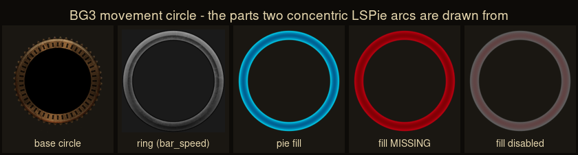

# STUDY 21 — the four files STUDY 20 extracted and did not read

`HotBar.xaml` (484 KB) · `DiceAnimation.xaml` (242 KB) · `CombatLog.xaml` (42 KB)
· `CombatantsOverlay.xaml` (35 KB). **Files only. The game was not launched.**

---

## ⚠⚠ FIRST — THIS CORRECTS `STUDY 20 §3`

`STUDY 20` said, of movement:

> *"grepping all 310 `.xaml` for `movement` returns zero screens… Nothing here
> says what the movement range looks like… that is the one target of the three
> that genuinely requires watching the game."*

**That grep was on FILENAMES. It was the wrong test, and it was mine.** The word
`movement` does not appear in a filename; **it appears 40+ times inside
`HotBar.xaml`**, which carries a complete movement-budget widget.

**What is genuinely still unreachable is narrower than I said:** the
**world-space** range indicator — the ring on the ground, the path spline, the
difficult-ground overlay. Those are decals and shaders. **The HUD half of
movement, including the partial-move readout, is fully readable and is below.**

**⚠ Two studies running, two wrong-directory negatives, both mine.** `STUDY 19`
searched `Stats/` and missed the GUI tree; `STUDY 20` searched filenames and
missed the file contents. **The instrument was rigorous and aimed one level too
shallow, twice.**

---

## 1 · HOW A BUTTON ADVERTISES ITS COST — and it mostly does not

> The owner: *"the hotbar is where a player reads the cost BEFORE hovering."*

**⚠ The finding is the opposite of the expectation, and it is better.** A hotbar
slot does **not** carry a cost badge. It carries a **command that lights up the
budget bar**:

```xml
<b:EventTrigger EventName="MouseEnter">
  <b:InvokeCommandAction Command="{Binding DataContext.HighlightResourcesCommand …}"/>
<b:EventTrigger EventName="MouseLeave">
  <b:InvokeCommandAction Command="{Binding DataContext.ClearResourceHighlightsCommand …}"/>
```

**The cost is not written on the button. The button POINTS AT the budget it will
spend.** `STUDY 20` found `PreviewState` on the bar and could not see what drove
it — **this is the other end of that wire.** Hover a slot, and the exact pips
turn white (`Highlight`); leave, and they clear.

### ⚠⚠ And the wire runs BOTH WAYS

`FilterActionResourceCommand` — **clicking a resource filters the hotbar to the
actions that spend it** (`CurrentSingleHotbarFilter`, with a
`ComparisonCondition` that clears the filter when you click the active one
again). So:

* **button → bar:** what will this cost me?
* **bar → button:** what can I do with this?

**Two directions over one relationship**, and the second is the one nobody
thinks to build.

### The hotbar also carries its own cost strip

`ActionResourcesContainer` holds `ActionResourcesList`, an `ItemsControl` bound
to `CurrentPlayer.UIData.ActionResourcesCostPreview` with item type
`ls:VMActionResourceCostPreview`, on a 64 px-high nine-slice background
(`MinWidth 208`, widened by an `AddConverter` as resources are added).
**Cost preview is a first-class view-model, not a tooltip.**

Slot content carries `SpellSlotLevel`, `SpellUpcast`, `IsModified`, `UseType`,
`WeaponActionType` — ⚠ **`IsModified` means a slot knows it is not showing the
default version of its action** (upcast, or a variant).

---

## 2 · ⚠⚠ THE PARTIAL MOVE — TWO ARCS ON ONE DIAL



*The shipped `.DDS` from `Public/Game/GUI/Assets/BottomBar/`. Note the base is a
**notched dial** — tick marks around the rim — not a plain circle.*

`MovementCircle` binds `CurrentPlayer.UIData.MovementResourceCostPreview` and
draws **two `ls:LSPie` arcs from the same origin**:

| pie | value | drawn as |
|---|---|---|
| `HighlightPie` | `ActionResource.Value / MaxValue` | `Ellipse Fill="#D0FFFFFF"` masked by `bar_speed_filler` — **translucent white** |
| `MovementPie` | **`ValueAfterUse` / MaxValue** | the `bar_speed_filler` image itself — **cyan** |

**`ValueAfterUse` is the whole answer.** One arc is what you have; the other is
what you will have **after the move you are currently aiming**. Since
`ValueAfterUse ≤ Value`, the cyan arc is shorter, and **the sliver between the
two arcs is the cost of the pending move, shown before you commit to it.**

*(Read from the construction — the two pies, their values and their fills. The
exact z-order and which arc reads as "on top" was not determined; that needs the
running game.)*

### Three states of intent, modelled as data

`Moving` · **`TryingToMove`** · `IsCasting` — all three are separate properties.
⚠ **"Trying to move" is not "moving."** The UI knows you attempted something you
cannot afford, and that is a distinct, drawn state.

| when | what happens |
|---|---|
| `Moving` **and** `InTurnBasedMode` | `UsagePie` becomes visible |
| `Cost + 0.001 ≥ Value` **and** `IsCasting` **and** `InTurnBasedMode` | `UsagePie` visible — **the spell you are aiming would eat all your movement** |
| `TryingToMove` **and** no movement left **and** `InTurnBasedMode` | `MovementErrorBar` flashes: opacity **0.9 → 0 over 0.68 s** |

**⚠ Being unable to move is not an error message and not a modal. It is a
0.68-second red flash on the dial you were already looking at.**

The tooltip — enabled **only** `InTurnBasedMode` — reads
`{Value} / {MaxValue}` through a `UnitConverter` with parameter
`'Distance RoundUp N1'`. ⚠ **Movement is stated in distance units to one
decimal, rounded UP.** Rounding up is the honest direction: it never promises
reach you do not have. And the icon swaps to `ico_speed_missing` at exactly
`Value == 0`.

---

## 3 · THE CEREMONY — what `DiceAnimation.xaml` actually is

238 KB, 3,555 lines, **152 distinct keyframe times**, longest duration 6 s.

**⚠ Set against `STUDY 20`'s finding, this is the sharpest form of the result:**

| | passive roll | active roll |
|---|---|---|
| on screen | ~6 s (5 s + 1 s fade) | ~6 s |
| what fills it | **static text** | **152 keyframes** |

**Near-identical wall-clock, utterly different investment.** *Ceremony
proportional to agency* is not about duration — it is about **how much happens**
in the same six seconds.

### The named timing constants, as shipped

```
bucket           0.07 → 1.05     d20 explosion    0.07 → 0.60
die text         0.42 → 1.95     highlight        0.17 → 1.23 → 1.38
trail starts     1.08            pop              0.72 → 1.25
text position    1.13 → 1.37     text scale       0.58 → 1.28
dice text        0.80 → 3.10     d20 spin         0.20 → 1.39
```

**The die is legible by ~1.4 s and the result text holds until ~3.1 s.** The
motion is front-loaded; the *reading* is what the time is spent on.

### What the animation is made of

* **`DoubleDieAnimation`, `DieHolder1`/`DieHolder2`, `RollAnimDie1`/`RollAnimDie2`**
  — **two physical dice for advantage/disadvantage**, not a recoloured one
* **`bucketLeft`/`bucketRight`, `bucketEdgeVfx`** — the die lands in a *bucket*;
  it has somewhere to arrive
* **`WaitingDieJump`** — the die **jumps while waiting**, so a pause reads as
  anticipation rather than a hang
* **`SlideInModAnim`, `modVal`, `modValText`** — ⚠ **modifiers slide in and join
  the die**; `JoiningVfsAnim`, `JoinPopExplHolder`, `JoinD20ExplHolder`. **The
  arithmetic is animated, not printed.**
* **`MinMaxText`, `textBlockMinMaxNumber`** — natural 1 and natural 20 get their
  own treatment
* **`Lock`, `LockTemplate`, `LockBoom1/2`, `LockPopExplosion1/2`** — a *locked*
  die, with its own explosion
* **`FailDCAnim`, `DCTextStyleBase`** — ⚠ **the DC is on screen and animates on
  failure.** You are shown the number you failed against.
* **`SuccessLoopAnimation`** vs `ResultFailAnimation` — ⚠ **success LOOPS;
  failure resolves and stops.** Winning sustains, losing concludes.
* **`BonussesTitle.FadeOut`, `toplist.FadeOut`, `BoostList.FadeOut`** — the
  modifier list **fades out as the result lands**, so the screen empties down to
  the number

---

## 4 · THE LOG, AND THE ROUND WITHOUT AN HOURGLASS

### ⚠⚠ BG3 runs TWO message surfaces, not one

`CombatLog.xaml` contains both:

* **`CombatFeed` / `CombatFeedMesssages`** *(sic — the typo ships)* — a
  **transient** feed with `FadeStoryBoard`, `AnimFadeStart`, `AnimEnd`
* **`CombatLog` proper** — persistent, scrollable, tabbed
  (`tabLog` · `tabChat` · `tabAll`)

**Our working line is one surface doing both jobs.** `STATE.md` records the
consequence: *"the working line grows without bound — six from one fight."*

### And the persistent log has three things ours does not

1. **`Data.CombatLog.EntryGroups`** — ⚠ **entries are GROUPED**, not a flat list.
2. **`MarkCombatLogGroupEntrySeen`** — ⚠⚠ **the log tracks whether you have SEEN
   a group.** Unread is a first-class state on a combat log.
3. **`btnIncreaseSize` / `btnDecreaseSize` / `LogResize`** — the player resizes
   it, and `CombatLogSize` is the **same three-valued property**
   (`normal`/`Expanded`/`SuperExpanded`) that `PassiveRoll` reads to move its own
   margin. **One player preference, honoured by an unrelated widget.**

Plus `btnScrollToLatest` and `CombatLogCollapsed`.

### The round boundary, where the hourglass does not reach

`CombatantsOverlay.xaml` is the turn-order strip, and it solves overflow:

* `Combatants.Count`, `MaxVisibleIconsAmount`, **`IsCombatantListOverflowed`**
* **`LeftCounter` / `RightCounter` with `LeftCounterText` / `RightCounterText`**

**⚠⚠ When the turn order is too long to fit, a COUNT sits at each end saying how
many are hidden left and how many right.**

**That is `STATE.md`'s own rule, arrived at independently by Larian:**

> *"⚠ WHEN A LIST CAN BE ELLIPSED, LEAD WITH THE COUNT. Truncation can then hide
> *which*, never *that*."*

**We derived that from a `find.textContaining` test passing on ellipsed text.
BG3 ships it on the turn order. The rule is confirmed from outside.**

Also `LeftScrollOnHold`/`RightScrollOnHold`, `ScrollToTargetAnimation`,
`PixelScrollTime` — the strip scrolls to the current combatant rather than
jumping.

---

## 5 · PT-1496 — the four questions

### On the hotbar and cost

1. **What does it do?** The button does not state its cost; it **highlights the
   budget it will spend**, on hover, and the budget bar filters the hotbar in
   return.
2. **Why?** Because with a plural action economy the useful question is not
   *"what does this cost"* in the abstract but *"can I still afford it, and what
   does that leave me?"* — which is a question about **the bar**, not the button.
   Putting a number on the button answers the wrong question.
3. **Does the reason still hold for us?** **Yes, and more strongly.** We have
   five budgets against BG3's common four, and `PT-1423`'s round is exactly where
   *"what does this leave me"* matters. ⚠ **Where it does not transfer:** BG3's
   hover is a mouse affordance on a 3D HUD. Ours is a tabletop projection and
   `PT-1443` wants **click-to-move with keys as an alternative** — so the
   highlight must be reachable by **selection**, not only by hover, or the
   keyboard path silently loses the preview.
4. **What is the modern form?** **Selecting an action highlights the budgets it
   spends**, and **selecting a budget filters the actions that spend it.** Both
   directions, driven by selection rather than hover so it survives the keyboard.

### On movement

1. **What does it do?** Two arcs on one dial: current, and **projected after the
   move being aimed**. Distance to one decimal, **rounded up**. Trying to move
   with nothing left is a 0.68 s flash, not an error.
2. **Why?** Movement is continuous and spent in fractions, so pips cannot show
   it and a bare number cannot show a *pending* spend. The projection is the only
   way to answer *"if I go there, what's left?"* before committing.
3. **Does the reason still hold for us?** ⚠ **Partly, and the difference
   matters.** BG3 spends metres along a free path; **we spend integers per
   square**, and `PT-1513` just made difficult ground cost **double**. On a grid,
   the projected remainder can be shown **exactly** — the sliver is a whole
   number of squares, not an arc. **A dial is the wrong instrument for a
   countable budget; the two-value idea is the right one.**
4. **What is the modern form?** **Show `ValueAfterUse` alongside `Value`** — the
   budget *and* what the pending action leaves. On a grid that is a count, not a
   pie. And ⚠ `PT-1513`'s doubling is exactly where this earns its keep: a path
   over difficult ground must show a remainder that is **not** the square count,
   or the doubling is invisible until it has already been paid.

### On the roll

1. **What does it do?** Two dice for advantage, a bucket to land in, modifiers
   that **slide in and join** the die, the DC on screen, success that **loops**
   and failure that **stops** — 152 keyframes against the passive toast's zero.
2. **Why?** The check is the tabletop's central drama and BG3 is selling exactly
   that feeling. Animating the arithmetic is how a table makes a sum feel like an
   event.
3. **Does the reason still hold for us?** **The structure yes, the spectacle no.**
   `PT-1326` already rules the line carries its derivation, and *modifiers
   joining the die* is that derivation made visible. But we are a projection,
   not a 3D game — **six seconds of VFX per skill check would be intolerable in a
   Builder-authored campaign where checks are frequent.**
4. **What is the modern form?** **Keep the ORDER, drop the runtime.** Show the
   terms, then the die, then the sum, then the verdict against a **visible DC** —
   sequenced so the arithmetic is readable, but in a beat rather than six
   seconds. And **`SuccessLoopAnimation` vs `ResultFailAnimation` is worth
   stealing outright**: a success that sustains and a failure that concludes
   costs nothing and reads instantly.

### On the log

1. **What does it do?** Splits transient from persistent, **groups** entries,
   tracks **seen**, and lets the player size it — with an unrelated widget
   honouring that size.
2. **Why?** A combat log is simultaneously a live feed and an audit trail, and
   those have opposite requirements: one must be glanceable and vanish, the other
   complete and searchable.
3. **Does the reason still hold for us?** **Yes, and it names a live defect.**
   `STATE.md`'s N2 — *"the working line grows without bound — six from one
   fight"* — is one surface serving both purposes.
4. **What is the modern form?** **Two surfaces.** A transient line that states
   what just happened and fades; a durable, **grouped** record that keeps
   everything. ⚠ **And grouping is the half that matters for us**, because our
   log is a ledger the engine replays — `EntryGroups` is the presentation of the
   same shape our events already have.

---

## 6 · ⚠ OWNER NOTE — the ring, on the tile

**Recorded as the owner's, not proposed by me.** On seeing the extracted circle
art:

> *"those circles… we should share those — this maybe ideas, rings off the
> creature circumstance show up on the tiles."*

**What the files support, and what they do not:**

* ⚠ **These particular circles are HUD, not world.** `MovementCircle` sits in
  `HotBar.xaml` at `VerticalAlignment="Bottom" HorizontalAlignment="Right"`,
  `Margin="0,0,154,13"` — **bottom-right of the screen**, attached to the
  selected character, not drawn at their feet. **Moving a ring from the HUD onto
  the tile is a genuine design move and is NOT what BG3 does with this art.**
* **BG3 does draw rings on the ground** — selection and range circles — **but
  those are world-space and are in none of the 310 `.xaml`.** `§6` below scopes
  that negative. **So this study cannot say what BG3's on-ground rings look like
  or carry**, and does not.
* ⚠ **What DOES transfer cleanly is the two-value idea**, `§2`: a ring that shows
  **`Value` and `ValueAfterUse` at once** — what the creature has, and what the
  action being aimed would leave. That reads as well around a token as it does in
  a corner, and arguably better, because on a grid the ring is **at the thing the
  cost is about.**
* ⚠ **And "circumstance" is a wider word than movement.** The dial is one
  resource. A ring around a token could carry concentration, a doctrine's state,
  *acted this round* — which is the job `TurnOrderLib` gives the
  **hourglass-per-portrait**, and `STUDY 20` recorded that as **not
  transferring, because we ship no portraits.** ⚠ **A ring on the tile is a
  candidate home for exactly that orphaned finding**, since the token is the one
  thing we always have.

**Not designed here, and nothing built.** `AREA-FORMAT-01 §2b` governs how an
area looks in **both** Loom and the app, so a per-tile ring is a `Lens` change
and a format question, not a screen tweak — and `BUILD-ORDER-01`'s resolution
rule is the owner's to apply.

**⚠ The art itself cannot be reused** — `art-reference/README.md` states why in
full. `ASSET-REPLACEMENT-01`: *reuse as reference, then recreate close but ours*,
and **`PT-1350`'s extraction bargain covers KOTOR, not Baldur's Gate 3.**

---

## 7 · What was NOT checked — scoped

* **The game was never launched** and, per the brief, **no attempt was made**.
  Nothing in this study comes from watching BG3.
* **World-space rendering is still unreached** — the movement ring on the ground,
  the path spline, the difficult-ground overlay. **Not in any `.xaml`**; scoped:
  all 310 searched by content, not only filename, for `movement`, `range`,
  `path`, `decal`.
* **Localisation was not resolved.** Every user-facing string is a handle
  (`h8454f8a0gadbb…`); `English.pak` was **not opened**. ⚠ **No player-facing
  wording is quoted anywhere in STUDY 20 or 21.** What a BG3 combat-log line
  actually *says* is unknown to us.
* **Colour claims come from the converted `.DDS`**, not from the theme
  dictionary — `LS_tint100`, `MainPiesStyle`, `BarResources` were not resolved.
* **The z-order of `HighlightPie` vs `MovementPie` was not determined**, so
  "the sliver between the arcs" is read from the two values and fills, not from a
  rendered frame.
* **`ActiveRoll.xaml` was analysed by name and binding only in `STUDY 20`** and
  was **not** re-read here against `DiceAnimation`; the two are a pair and the
  seam between them was not traced.
* **`TurnModeInfo.xaml` (79 KB)** was listed in `STUDY 20` and **still has not
  been read in full** — only its names and bindings.
* **Controller (`_c`) variants were not diffed against keyboard layouts.** ⚠ The
  keyboard resource bar **has still not been located**; `ActionResources_c` is
  the controller one, and `STUDY 20`'s pip findings may be the controller layout.
* **No `HotBar.xaml` tooltip content was read** — `LSTooltip` with
  `TooltipExtender.Context="Hotbar"` resolves elsewhere and was not followed.
  **That is where a per-action cost may be written in words**, and it is the
  first thing to check next.
