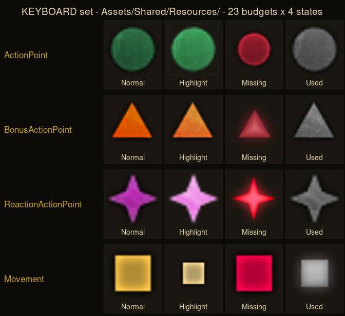

# STUDY 22 — the keyboard bar, the written cost, the round, and the wording

**Files only. The game was not launched, and no launch was attempted.**

---

## 1 · ⚠⚠ `PT-1517` IS VERIFIED. IT IS NOT A GAMEPAD-ONLY FINDING.

`STUDY 21` closed with a caveat: *"the keyboard resource bar has still not been
located, so STUDY 20's pip findings may be the CONTROLLER layout."* **Settled.**

### There is no keyboard `ActionResources.xaml` — because the keyboard bar lives in the hotbar

Exactly three files exist in `Game.pak`:

| file | input |
|---|---|
| `Mods/MainUI/GUI/Pages/HotBar.xaml` | **keyboard/mouse — no `_c` twin exists** |
| `Mods/MainUI/GUI/Pages/ActionResources_c.xaml` | controller |
| `Public/Game/GUI/Library/ActionResourceTemplates_c.xaml` | controller |

`ActionResources` and `ActionResourceTemplates` are **controller-only** — but the
keyboard is not missing a bar. `HotBar.xaml` carries `ActionResourcesContainer`,
`ActionResourcesList` and `MovementCircle` **inside itself**. The controller
needs separate files because its shell is radial; the keyboard's bar is part of
the hotbar.

⚠ **And BG3 uses `_k` as well as `_c`** — six `_k` files against 118 `_c`.
`STUDY 21`'s pairing only searched `_c` and therefore mis-framed the question.

### The mechanism is SHARED and data-driven — this is the real finding

`HotBar.xaml` renders each budget with
`<ls:LSActionPointResources Style="{StaticResource ActionResourcesTemplateSelector}">`,
and that style is defined in **`Public/Game/GUI/Library/DataTemplates.xaml` — no
suffix, shared.** It selects a template per `TypeId`.

The template it selects resolves to one shared `DataTemplate`, and **the art is
computed, not hardcoded**:

```xml
<MultiBinding Converter="{StaticResource IconIdToSourceConverter}"
              FallbackValue="{StaticResource TypeIdToSourceFallback}">
  <Binding Source="{StaticResource ActionResourcePointIconsPath}"/>
  <Binding Path="DataContext.TypeId" .../>
</MultiBinding>
```

with a `DataTemplate.Trigger` on `ActionPointState` swapping the *path* constant.
Resolving those constants:

| input | normal | highlight | used | missing |
|---|---|---|---|---|
| **keyboard** | `Assets/Shared/Resources/` | `…/Highlight/` | `…/Used/` | `…/Missing/` |
| **controller** | `Assets/ActionResources_c/Icons/Resources/` | `…/Highlight/` | `…/Used/` | `…/Missing/` |

> **⚠⚠ THE FOLDER IS THE STATE. THE FILENAME IS THE `TypeId`, AND THEREFORE THE
> IDENTITY.**

**That is `PT-1517` stated as a mechanism rather than an observation**, and it is
the same mechanism on both inputs. Two art sets, one convention.

### The keyboard art, shown



*`Public/Game/GUI/Assets/Shared/Resources/`, converted DDS→PNG.*

| budget | keyboard shape | controller shape (`STUDY 20`) |
|---|---|---|
| `ActionPoint` | **circle** | circle |
| `BonusActionPoint` | **triangle** | triangle |
| `ReactionActionPoint` | **four-point star** | four-point star |
| `Movement` | ⚠ **square** | ⚠ **diamond** |

**Shape carries identity in both sets.** One difference: **Movement is a square
on keyboard and a diamond on controller.** *(A square rotated 45° is a diamond;
they are two distinct files and were not compared pixel-wise.)*

⚠ **A second difference in the STATE axis:** on the **controller** set,
`Highlight` is **white**; on the **keyboard** set, `Highlight` is a **brighter
version of the budget's own hue**. So keyboard keeps the identity colour even
while previewing, and controller does not. *(Read from the converted art, which
is flattened onto an opaque background — see `§6`.)*

### ⚠ And the keyboard set is the RICHER one

**96 files under `Assets/Shared/Resources/` — 23 budgets × 4 states, plus 4
stragglers.** Every budget has bespoke four-state art:

`ActionPoint · ArcaneRecoveryPoint · BardicInspiration · BonusActionPoint ·
ChannelDivinity · ChannelOath · FungalInfestationCharge · KiPoint ·
LayOnHandsCharge · LuckPoint · Movement · NaturalRecoveryPoint · Rage ·
ReactionActionPoint · RitualPoint · ShadowSpellSlot · SorceryPoint · SpellSlot ·
SuperiorityDie · TidesOfChaos · WarPriestActionPoint · WarlockSpellSlot ·
WildShape`

⚠ **This kills a refinement I was about to file.** The shared selector sets only
a `Foreground` colour for `SuperiorityDie`, `NaturalRecoveryPoint` and
`WildShape`, which looked like *"bespoke shapes for common budgets, colour-only
for rare ones."* **It is not** — those three have their own art too. The
`Foreground` is a tint applied over it, and the colour-only path exists solely as
a **fallback** (`TypeIdToSourceFallback` → `ico_red_star.png`) for a budget with
no art at all.

⚠ **One budget of 24 breaks the naming convention**: `ArcaneShot` ships as
`ico_classRes_arcaneShot_{d,h,missing,spent}` instead of one filename in four
folders. **A convention with a single exception, in shipped data.**

### Two more concrete numbers

* **`MaxGroupActionPoints = 4`**, and `HotBar.xaml`'s `ResourcesNumeralDisplay`
  becomes visible when `Value > MaxGroupActionPoints`. ⚠ **Up to four pips you
  count; above four it becomes a numeral.** That is a measured countability
  threshold, not a guess.
* **Spell slot levels are ROMAN NUMERALS** — `RomanNumeralLevelI…` style on
  `SpellSlotLevels`.

### PT-1496

1. **What does it do?** One shared, data-driven convention — folder = state,
   filename = identity — with two art sets so each input method can have its own
   drawing while the *system* stays identical.
2. **Why?** Because the alternative is authoring N budgets × 4 states × 2 inputs
   of bespoke XAML. Deriving the path from `TypeId` means **adding a budget is
   adding four PNGs**, not editing a layout.
3. **Does the reason still hold for us?** **Yes, and it is cheap.** We have five
   budgets and one input surface. ⚠ **Where it does not transfer:** BG3 has two
   art sets because it has two input shells; we have one, so we need one set —
   the *convention* transfers, the duplication does not.
4. **What is the modern form?** **Derive the icon from the budget's id and its
   state**, so a new budget is four files and no code. And keep the fallback: an
   unknown budget must draw *something* and BG3's answer is a red star, which is
   visibly a placeholder — `PT-1157`'s rule, arrived at independently.

---

## 2 · THE THIRD ANSWER — A TOOLTIP THAT **WRITES** THE COST

`STUDY 21` found two answers (the bar previews on hover; the button points at the
budget). **This is the third, and the owner is right that it transfers best**,
because it needs **no hover state and no pointer at all.**

`Public/Game/GUI/Library/Tooltips.xaml` (681 KB) defines `FooterCosts`:

```xml
<DataTemplate x:Key="FooterCosts">
  <ItemsControl AlternationCount="{Binding Count}" ItemsSource="{Binding .}"
                Visibility="{Binding Count, Converter={StaticResource CountToVisibilityConverter}}">
    …
      <ContentPresenter ContentTemplate="{StaticResource FooterFloatingWarningCost}" .../>
      <TextBlock ls:TextBlockFormatter.SourceText="{Binding …}"/>
```

**One row per resource: an icon, then the cost written as text.** Properties
worth naming:

* **`CountToVisibilityConverter`** — ⚠ **a free action shows no cost block at
  all**, rather than "Cost: none". Absence is drawn as absence.
* **`IsHidden` per row** — an individual cost can be suppressed.
* Each row carries **its own sub-tooltip** (`ManagedTooltip`).
* `RitualCost` and `IgnoreCost` are separate bindings — the circumstance-varying
  costs `STUDY 20` found in the stats data reach the UI as their own fields.

### ⚠ And an unaffordable cost BOUNCES

`FooterFloatingWarningCost` wraps a `BouncingWarning` grid:

```xml
<ThicknessAnimation Storyboard.TargetProperty="Margin" Duration="0:0:2"
                    AutoReverse="True" RepeatBehavior="Forever">
  <ThicknessAnimation.EasingFunction><SineEase EasingMode="EaseInOut"/>
```

**A two-second sine, auto-reversing, forever.** Attention without alarm — it
never stops, and it never flashes.

### PT-1496

1. **What does it do?** States each cost as icon-plus-words in the action's own
   tooltip, hides the block entirely when free, and marks an unaffordable line
   with a slow permanent bounce.
2. **Why?** Because the bar-highlight answer requires a pointer and a hover, and
   BG3 still needs to work on a gamepad, in a tooltip you opened deliberately,
   and for a player reading rather than aiming.
3. **Does the reason still hold for us?** ⚠ **It holds harder for us than for
   BG3.** `PT-1443` wants **click-to-move with keys as an alternative**, and
   *every* hover-based answer fails a keyboard player. **A written cost is the
   only one of the three answers that survives having no pointer.**
4. **What is the modern form?** **Write the cost.** Icon plus text, one line per
   budget, **no block at all when it is free**, and a persistent non-flashing
   mark on the line you cannot pay. It needs no hover, no preview state, and no
   animation budget.

---

## 3 · THE ROUND BOUNDARY — ⚠ AND `STUDY 20` NAMED THE WRONG MARKER

`STUDY 20` said: *"the round boundary is drawn as an HOURGLASS on the portrait of
anyone already waiting for the next round."* **Reading `TurnModeInfo.xaml` in
full shows two separate markers, and the hourglass is the narrower one.**

```xml
<!-- Grey Overlay -->
<Rectangle x:Name="ActedThisRoundAlready" Fill="DimGray"
           Width="106" Height="159" Opacity="0.7" .../>

<!-- Hourglass icon, if end turn was requested -->
<Control x:Name="turnTakenIndicator" Template="{StaticResource HourglassTemplate}"/>
```

*The second comment is Larian's own, in the file.*

| state | marker |
|---|---|
| **has acted this round** | a **DimGray rectangle at 0.7 opacity over the whole entry** |
| **end turn was requested** | the **hourglass** |

**Two different facts, two different treatments — and only the second is an
icon.**

### ⚠⚠ This un-orphans the finding

`STUDY 20` had to discard the hourglass because *"it needs a portrait, and
`UI-ASSETS-01` records we ship no portrait set."*

**The grey wash needs no portrait.** It is a translucent rectangle over an entry.
**A row, a name cell, a token on a tile — anything with a rectangle can take
it**, and it is the marker for the state we actually care about (*is this
creature done this round?*).

### The rest of the strip

* **Almost entirely iconic** — 39 `Icon` against **3 `TextBlock`** in the whole
  882-line file. The only text is counters.
* **Health is the entry, not a bar beside it** — a `ProgressBar` at 106×159,
  the same footprint as the portrait.
* **`KBIntroBS1/2` vs `PADIntroBS1/2`** — even the intro animation is authored
  per input method.
* **Team runs are bracketed** — `DefaultFrameBegin/Middle/End` and `…Selected`,
  and ⚠ **the hourglass's margin is nudged per position** (`0,0,22,3` /
  `0,0,20,3` / `0,0,16,3`) so it stays put as the frame changes shape.
* **`OverflowText`** — status effects beyond the visible limit collapse to a
  count. ⚠ **That is the second instance of "lead with the count" in this one
  file**, alongside `LeftCounter`/`RightCounter` for the combatant list.

### PT-1496

1. **What does it do?** Greys out a combatant who has acted; reserves an icon for
   the narrower fact that end-turn was *requested*; counts what it cannot show.
2. **Why?** *Has acted* applies to every entry every round, so it must cost
   nothing to draw and never occlude. *End turn requested* is rarer and is a
   queued intent, so it earns a glyph.
3. **Does the reason still hold for us?** **Yes, and the grey wash is directly
   usable** — we have tokens on a grid and no portraits. ⚠ **Where it does not
   transfer:** BG3's strip is a horizontal row of large portraits with joined
   frames; ours is a projection over a board. **The bracketing of team runs
   assumes a strip, and we have no strip.**
4. **What is the modern form?** **Desaturate the done.** A translucent wash over
   the token or its row, applied to whatever entry we already draw — and keep an
   icon in reserve for a *different* fact, not the same one.

---

## 4 · LOCALISATION — ⚠ NAMED, AND THEN OPENED, BECAUSE IT COST ALMOST NOTHING

The owner asked me to **say what it would take**. Answer: **a 70-byte struct and
the LZ4 reader we already have.** That was cheap enough that stopping at the
description would have been the wrong call, so it is open, and
**`tools/loca.py`** is committed.

```
Localization/English.pak → Localization/English/english.loca   (30.8 MB, LZ4)
LOCA: "LOCA" · uint32 numEntries · uint32 textsOffset
entry (70 bytes): char[64] key · uint16 version · uint32 length
texts: NUL-terminated UTF-8, concatenated, in entry order   (length INCLUDES the NUL)
```

**232,878 strings.**

### ⚠ The first player-facing wording quoted in any of these studies

`STUDY 20`'s passive-roll toast, with its handles resolved:

| handle | string |
|---|---|
| `h8454f8a0…` | **`Check`** |
| `h820e2fca…` | **`Succeeded`** |
| `ha81a7198…` | **`Save Failed`** |

So the toast reads:

```
{Skill} Check   [d20]   Succeeded, {RollResult} ({Skill})
{Skill} Check   [d20]   Save Failed, {RollResult} ({Skill})
```

⚠ **The two branches are not parallel — "Succeeded" against "Save Failed"** —
and the failure string is the *default*, with success as the `DataTrigger`
override. `Save Failed` also reveals these toasts are for **saving throws**
specifically.

Also resolved: the resource tooltip subtitle is **`Replenishable Resource`**; the
consumable marker is **`Single Use`**.

### ⚠ And the budgets are NOT called what the data calls them

| `TypeId` in data | shown to the player |
|---|---|
| `ActionPoint` | **`Action`** |
| `BonusActionPoint` | **`Bonus Action`** |
| `ReactionActionPoint` | **`Reaction`** |
| `Movement` | `Movement` |

**The internal id and the displayed name deliberately differ**, and the icon
filename follows the *id*. This project has repeatedly found *a value used as a
key*; **this is the disciplined version — the key is never shown, and the shown
name is never used as a key.**

### ⚠⚠ `<LSTag>` — and this is `§4c`'s question answered

**4,569 strings (2.0%) carry inline markup**, across **891 distinct tooltip
targets**:

```
The wearer's <LSTag Tooltip="MovementSpeed">movement speed</LSTag> is unimpeded
by <LSTag Type="Status" Tooltip="DIFFICULT_TERRAIN">Difficult Terrain</LSTag>.
```

Typed: `Status` 1,640 · `Spell` 783 · `Image` 311 · `ActionResource` 111 ·
`Passive` 47 · `Damage` 8. Most-referenced targets are **rules concepts**:
`SavingThrow` 635 · `AttackRoll` 515 · `Advantage` 376 · `AbilityCheck` 360 ·
`Disadvantage` 359 · `Resistant` 261 · `ArmourClass` 171 · `MovementSpeed` 156 ·
`ProficiencyBonus` 152 · `HitPoints` 146 · `SpellSlot` 144.

> **⚠⚠ `DIFFICULT_TERRAIN` is the SAME identifier `STUDY 19` found in
> `Status_BOOST.txt` carrying `ActionResourceConsumeMultiplier(Movement, 4, 0)`.
> One token, two consumers: the engine resolves it as a rule, the sentence
> renders it as a hoverable term.**

**BG3 does not bracket the option. It marks up the rules term inside the prose**,
declares its *type* so the lookup is unambiguous, and lets the reader hover the
word.

**And 2,550 strings use `[1]`/`[2]` positional substitution** — the sentence is
authored and the numbers are injected, so wording and arithmetic never fuse.

### PT-1496

1. **What does it do?** Keeps every player string in one keyed table, never
   builds a sentence from fragments (`[n]` substitution instead), and marks rules
   terms inline with a *typed* tag pointing at the same identifier the rules data
   uses.
2. **Why?** Localisation forces it — a sentence assembled from parts cannot be
   translated. The typed tag exists because `Status`, `Spell` and `ActionResource`
   have separate id spaces and a bare name would be ambiguous.
3. **Does the reason still hold for us?** ⚠ **The localisation reason does not —
   we ship one language.** But **two others do, and they are ours already:**
   `check_player_strings` guards Dart string literals and `check_annotations`
   guards TOML cells, and `STATE.md` records the gap between them — *a citation
   assembled at runtime falls between the two guards.* **`[n]` substitution
   closes exactly that gap**, because a string with holes is still one string in
   one place. And `§4c`'s bracket is our version of the inline tag.
4. **What is the modern form?** **A player string is authored whole with numbered
   holes, and never concatenated.** And ⚠ **a rules term inside a sentence is
   marked up with its type and id** — which is strictly better than a bracket
   around the whole option, because it says *which word* is the rule, and it
   reuses the id the engine already has instead of inventing display text.

---

## 5 · Two corrections to my own earlier studies

| | |
|---|---|
| `STUDY 21` framed the input split as `_c` versus no-suffix | ⚠ **`_k` exists too** — 6 files. The pairing analysis was incomplete and mis-shaped the keyboard question. |
| `STUDY 20` called the hourglass the round-boundary marker | ⚠ **Wrong marker.** *Acted this round* is a DimGray 0.7 wash; the hourglass is *end turn requested*. Larian's own comment says so. **And the correction un-orphans the finding**, because a wash needs no portrait. |

---

## 6 · What was NOT checked — scoped

* **The game was never launched and no attempt was made.** Nothing here comes
  from watching BG3.
* **World-space rendering remains unreached** — the ground ring, path spline and
  difficult-terrain overlay are decals, in no `.xaml`. **Unchanged since
  `STUDY 21`.**
* **Colour claims come from converted `.DDS` flattened onto an opaque
  background.** Alpha and any theme tint are not accounted for. **Shapes are
  unambiguous; exact hues are not.** The `Highlight`-is-white-vs-brighter-hue
  difference in `§1` rests on that flattening and **should be confirmed against
  a rendered frame before it is relied on.**
* **Keyboard and controller Movement art were not compared pixel-wise** — square
  vs diamond may be one asset rotated.
* **`ActiveRoll.xaml`'s handles were not resolved**, though `loca.py` now makes
  it a five-minute job. **The active-roll wording is still unknown**, and it is
  the richer of the two roll surfaces.
* **`CombatLog` entry wording was not resolved** either — how a BG3 log line
  actually reads is still unknown, and it is the closest analogue to our working
  line.
* **`Tooltips.xaml` is 681 KB and only `FooterCosts`,
  `FooterFloatingWarningCost` and `VMActionResourceTooltip` were read.**
  `SpellDescriptionTemplate`, `AttackRollTooltipTemplate`, `RollDiceSet` and
  `SpellModifiersSection` are all named, unread, and all bear on `PT-1326`.
* **`DataTemplates.xaml` is 321 KB; only the resource selector and the
  `ActionPoint` template were read.**
* **The `_k`/`_c` art sets were compared by path and by four sample budgets, not
  exhaustively** — 23 budgets were listed from the keyboard set; the controller
  set was not fully enumerated.
* **`loca_en.json` was written to the scratchpad and is NOT committed** — it is
  30 MB of Larian text. `tools/loca.py` regenerates it in seconds.
* ⚠ **No Larian art or text may ship** — `ASSET-REPLACEMENT-01`, and `PT-1350`'s
  extraction bargain covers KOTOR, not BG3. `STUDY 21`'s
  `art-reference/README.md` states it in full and applies here too.
